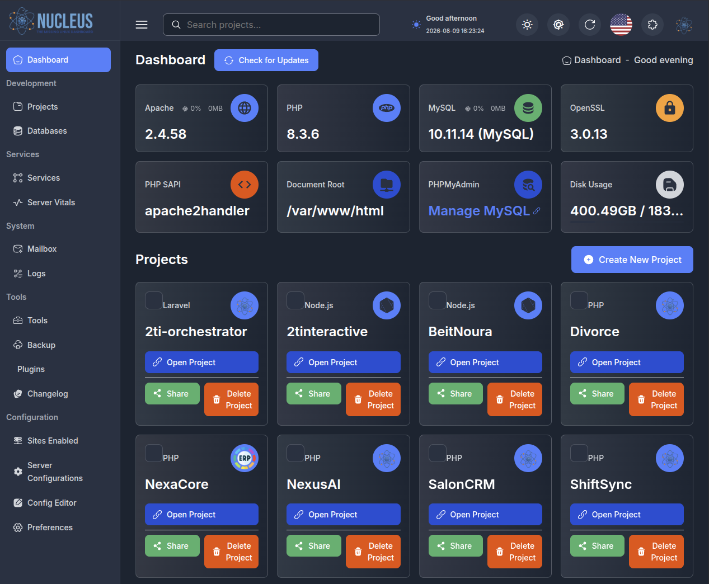
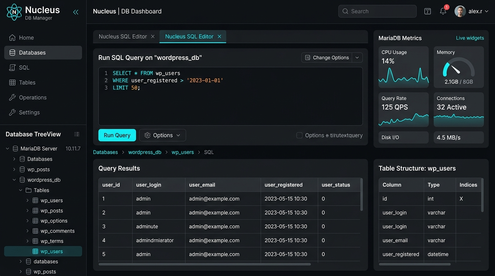

# ⚛️ Nucleus

### The Missing Dashboard for Linux Developers

A lightweight, central control panel for Linux development environments. Nucleus scans your web root, detects your projects, manages your services via systemd, and gives you a modern web interface to orchestrate your entire local dev stack — no Windows, no WAMP, no compromises.

Born from [Laragon Dashboard](https://github.com/LebToki/Laragon-Dashboard) (v4.0.5 for Windows), Nucleus is the Linux-native evolution — purpose-built for ZorinOS, Ubuntu, and Linux Mint.

[](https://github.com/LebToki/Nucleus)
[](https://php.net)
[](https://getbootstrap.com)
[]()
[](LICENSE)
[](https://github.com/LebToki/Nucleus)

<p align="center">
  
</p>
<p align="center">
  
</p>

<p align="center">
  
  
  
</p>

---

## 🎯 Why Nucleus?

Linux developers deserve a first-class local dev experience. Until now, managing Apache/Nginx vhosts, PHP-FPM pools, MySQL databases, systemd services, and project scaffolding meant juggling terminal commands, scattered config files, and third-party tools.

**Nucleus changes that.** One dashboard. All your projects. All your services. Zero bloat.

### Design Principles

| Principle | What It Means |
|-----------|---------------|
| **Non-Destructive** | Reads and parses scattered config files (`/etc/apache2/`, `/etc/nginx/`, `/etc/php/`) without overwriting your custom modifications. Your configs stay yours. |
| **Systemd-Native** | Interfaces directly with `systemctl` and `journalctl` to monitor, restart, and inspect daemons — Apache, Nginx, PHP-FPM, MySQL/MariaDB, Redis, and more. |
| **Permission-Aware** | Handles `sudo` and `pkexec` gracefully — no constant password prompts, no security holes. Configurable privilege escalation that respects your system's security model. |
| **Modular** | Core logic for detecting and managing services is decoupled from the UI. New PHP version? Different database engine? The community can patch detection logic without touching the frontend. |
| **Zero Bloat** | No Electron. No Docker-in-Docker. Pure PHP + Apache/Nginx. Runs on the same stack it manages. |

---

## ✨ Features

### 📁 Project Management
- **Auto-Discovery** — Scans `/var/www/html/` and detects projects automatically
- **Framework Detection** — WordPress, Laravel, Symfony, Drupal, CodeIgniter, CakePHP, Joomla, Next.js, Astro, and more
- **Quick Access** — Direct links to project URLs via `.local` vhost domains
- **Project Actions** — Ignore, .env editor, right-click context menus
- **Favicon Extraction** — Pulls favicons from detected frameworks

### 🛠️ Service Management (systemd)
- **Start/Stop/Restart** — Apache2, Nginx, PHP-FPM, MySQL/MariaDB, Redis, Memcached, PostgreSQL, MongoDB
- **Real-time Status** — Live service state via `systemctl is-active`
- **Journal Integration** — View service logs via `journalctl -u <service>` directly in the dashboard
- **Port Monitoring** — See what's listening on your system
- **Version Detection** — Automatic detection of installed service versions

### 📊 Server Vitals
- **CPU & Memory** — Real-time system resource monitoring
- **Disk Usage** — Track storage across all mounted volumes
- **PHP Info** — Version, extensions, memory limits, SAPI
- **OpenSSL** — Version and cipher info
- **Apache/Nginx** — Version, loaded modules, virtual host count

### 🗄️ Database Management
- **Universal Browser** — Browse all databases with real-time size calculations
- **Table Explorer** — Deep-dive into structures, row counts, indices, constraints
- **Safe SQL Runner** — Execute SELECT queries with read-only mode
- **Engine & Collation Tracking** — Monitor storage engines and character sets

### 📋 Log Viewer
- **Multi-Source** — Apache, Nginx, PHP-FPM, MySQL, systemd journal
- **Configurable Display** — Adjust line count (10–10,000)
- **Terminal-Style** — Easy-to-read monospace format
- **Search & Filter** — Find what matters in noisy logs

### 🔧 Quick Tools
- **Cache Management** — Clear Laravel, WordPress, Composer, and NPM caches
- **Database Optimization** — Optimize all tables in a database
- **Git Integration** — Check status across all projects
- **Composer Commands** — Install, update, dump-autoload
- **NPM Commands** — Install, update, build
- **PHP Info** — Quick access to full PHP configuration

### 🌍 Multi-Language Support
- **8 Languages** — English, German, Spanish, French, Indonesian, Portuguese, Tagalog, Arabic
- **Easy Switching** — Quick language selector in the navbar

### 🔒 Security
- **CSRF Protection** — Token-based form security
- **Rate Limiting** — Brute force prevention
- **Input Sanitization** — XSS and injection protection
- **Security Headers** — X-Frame-Options, CSP, HSTS, and more
- **Authentication** — Optional password protection with session management

### 🤖 AI Agent (Beta)
- **BYOK Chat Widget** — Bring-your-own-key AI assistant for project scaffolding and troubleshooting
- **System Context Bridge** — Real-time environment data fed to the agent

---

## 🖥️ Platform Support

| Platform | Status |
|----------|--------|
| **ZorinOS 17+** | ✅ Primary target |
| **Ubuntu 22.04+** | ✅ Fully supported |
| **Linux Mint 21+** | ✅ Fully supported |
| **Debian 12+** | ✅ Supported |
| **Other Linux** | ✅ Should work (systemd-based distros) |
| **Windows** | ❌ Use [Laragon Dashboard](https://github.com/LebToki/Laragon-Dashboard) |
| **macOS** | ❌ Not yet supported |

---

## 🛠️ Installation

### Prerequisites

- **PHP 8.1+** with extensions: `json`, `mbstring`, `openssl`, `pdo_mysql`, `curl`
- **Apache2** or **Nginx** web server
- **MySQL/MariaDB** (optional, for database management features)
- **systemd** (for service management)

### Quick Setup

#### 1. Clone the Repository

```bash
cd /var/www/html
sudo git clone https://github.com/LebToki/Nucleus.git .
```

Or download the [latest release](https://github.com/LebToki/Nucleus/releases):

```bash
cd /var/www/html
sudo wget https://github.com/LebToki/Nucleus/releases/download/v1.2.0/nucleus-v1.2.0.zip
sudo unzip nucleus-v1.2.0.zip -d .
```

#### 2. Set Permissions

```bash
sudo chown -R www-data:www-data /var/www/html
sudo chmod -R 755 /var/www/html
sudo chmod -R 775 /var/www/html/cache /var/www/html/data /var/www/html/logs
```

#### 3. Configure Apache

Enable required modules:

```bash
sudo a2enmod rewrite headers
sudo systemctl restart apache2
```

Ensure your Apache virtual host allows `.htaccess` overrides:

```apache
<Directory /var/www/html>
    Options -Indexes +FollowSymLinks
    AllowOverride All
    Require all granted
</Directory>
```

#### 4. Set Admin Password

```bash
# Option A: Environment variable (recommended)
sudo systemctl set-environment NUCLEUS_PASSWORD=YourStrongPassword123!
sudo systemctl restart apache2

# Option B: Edit config.php
sudo nano /var/www/html/config.php
# Change: define('ADMIN_PASSWORD', 'YourStrongPassword123!');
```

#### 5. Access Nucleus

```
http://localhost/
```

Or via your `.local` domain:

```
http://nucleus.local/
```

---

## ⚙️ Configuration

Nucleus auto-detects your Linux environment. Edit `config.php` to customize:

```php
// Auto-detected (no manual configuration needed)
APP_NAME = 'Nucleus'
APP_VERSION = '1.2.0'

// Project root detection order:
// 1. PROJECTS_ROOT environment variable
// 2. LARAGON_ROOT environment variable (backward compat)
// 3. Apache DOCUMENT_ROOT (strips /html suffix)
// 4. Fallback: /var/www

// MySQL Configuration
MYSQL_HOST = 'localhost'
MYSQL_USER = 'root'
MYSQL_PASSWORD = ''  // Set via environment variable in production

// Application Settings
APP_DEBUG = false          // Debug banner disabled by default
APP_ENV = 'production'     // development, staging, production
AUTH_ENABLED = true        // Password protection enabled
SESSION_LIFETIME = 3600    // 1 hour
```

### Environment Variables

| Variable | Description | Default |
|----------|-------------|---------|
| `NUCLEUS_PASSWORD` | Admin password | (must be set) |
| `PROJECTS_ROOT` | Override project root path | Auto-detected |
| `APP_DEBUG` | Enable debug mode | `false` |

---

## 📁 Project Structure

```
nucleus/
├── api/                    # API endpoints (JSON)
│   ├── services.php        # systemd service management
│   ├── databases.php       # Database management
│   ├── vitals.php          # Server monitoring
│   ├── logs.php            # Log viewer (journalctl + file)
│   ├── tools.php           # Quick tools
│   ├── backup.php          # Backup & export
│   └── projects.php        # Project management
├── assets/                 # Static assets
│   ├── css/               # Stylesheets (Bootstrap 5.3.2)
│   ├── js/                # JavaScript
│   ├── images/            # Images and icons
│   └── fonts/             # Web fonts + Iconify
├── i18n/                  # Internationalization (8 languages)
├── includes/               # Core classes
│   ├── Core/
│   │   ├── System.php     # Platform detection (Linux/Windows)
│   │   ├── Services.php   # systemd service management
│   │   ├── Databases.php  # Database operations
│   │   ├── Security.php   # Auth, CSRF, rate limiting
│   │   ├── Cache.php      # File-based caching
│   │   └── Logger.php     # Structured logging
│   ├── helpers.php         # Project scanning, utilities
│   ├── Router.php          # URL routing
│   └── autoload.php        # Class autoloader
├── pages/                  # Page templates
│   ├── dashboard.php       # Main overview
│   ├── projects.php        # Project grid
│   ├── services.php        # Service management
│   ├── databases.php       # Database browser
│   ├── vitals.php          # Server monitoring
│   ├── logs.php            # Log viewer
│   ├── tools.php           # Developer tools
│   ├── sites.php           # Virtual hosts viewer
│   ├── httpd.php           # Apache/Nginx config viewer
│   └── preferences.php     # Settings
├── partials/               # Layout components
│   ├── layouts/            # Top/bottom layout wrappers
│   ├── head.php            # Meta tags, CSS
│   ├── sidebar.php         # Navigation sidebar
│   ├── navbar.php          # Top navigation bar
│   ├── footer.php          # Footer
│   └── scripts.php         # JavaScript includes
├── config.php              # Main configuration
├── index.php               # Front controller + router
├── .htaccess               # Apache rewrite rules
└── README.md               # This file
```

---

## 🔌 Modular Architecture

Nucleus is designed for extensibility. The service detection layer is fully decoupled from the UI:

### Adding a New Service Detector

```php
// includes/Core/Services/Detectors/PostgreSQL.php
namespace Nucleus\Core\Services\Detectors;

class PostgreSQL implements DetectorInterface
{
    public function name(): string { return 'PostgreSQL'; }
    
    public function detect(): ServiceStatus
    {
        return new ServiceStatus(
            name: $this->name(),
            active: $this->systemdActive('postgresql'),
            version: $this->getVersion('psql --version'),
            port: $this->getListeningPort(5432),
            unit: 'postgresql.service',
        );
    }
    
    public function config(): array
    {
        // Non-destructive: READ only, never write
        return $this->parseConfig('/etc/postgresql/*/main/postgresql.conf');
    }
}
```

### Adding a New Framework Detector

```php
// In helpers.php analyzeProject()
elseif (file_exists($path . '/nuxt.config.ts') || file_exists($path . '/.nuxt')) {
    $project['platform'] = 'Nuxt.js';
    $project['icon'] = 'devicon-plain:nuxtjs';
    $project['color'] = 'success';
}
```

---

## 🔒 Security Model

### Permission Handling

Nucleus operates within Linux's permission model:

| Operation | Method | Notes |
|-----------|--------|-------|
| Read service status | `systemctl status` | No sudo needed |
| Read journal logs | `journalctl --no-pager` | No sudo needed (if in `systemd-journal` group) |
| Start/stop services | `sudo systemctl` | Requires sudo — configurable via `pkexec` or passwordless sudoers |
| Read config files | Direct file read | Non-destructive — never modifies `/etc/` files |
| Write project files | Direct write | Only within `/var/www/html/` |

### Configuring Privilege Escalation

For service management without constant password prompts:

```bash
# Option 1: Add www-data to systemd-journal group (log reading)
sudo usermod -aG systemd-journal www-data

# Option 2: Passwordless sudo for specific commands (use with caution)
sudo visudo
# Add: www-data ALL=(ALL) NOPASSWD: /usr/bin/systemctl status *, /usr/bin/systemctl is-active *

# Option 3: Use polkit rules (recommended for desktop environments)
sudo nano /etc/polkit-1/rules.d/50-nucleus.rules
```

---

## 🐛 Troubleshooting

### Diagnostic Tool

```
http://localhost/diagnostic.php
```

Shows: server config, path detection, file system checks, asset verification.

### Common Issues

**Projects not detected:**
- Check that `/var/www/html/` contains your project directories
- Clear cache: `rm /var/www/html/cache/projects_cache.json`
- Verify `www-data` has read permissions on project directories

**Services showing as unknown:**
- Ensure `systemctl` is available: `which systemctl`
- Check that `www-data` can read service status
- Add `www-data` to `systemd-journal` group for log access

**CSS/JS not loading:**
- Check Apache `mod_rewrite` is enabled: `sudo a2enmod rewrite`
- Verify `.htaccess` is being read: `AllowOverride All` in vhost config
- Clear browser cache (Ctrl+Shift+Delete)

**Authentication issues:**
- Set password via environment variable: `NUCLEUS_PASSWORD`
- Check session path is writable: `sys_get_temp_dir()`
- Clear browser cookies for the domain

---

## 🤝 Contributing

We welcome contributions! Nucleus is designed to be community-extensible.

### Development Setup

```bash
git clone https://github.com/LebToki/Nucleus.git
cd Nucleus
# Copy to your web root for development
sudo rsync -av . /var/www/html/
sudo chown -R www-data:www-data /var/www/html/
```

### Guidelines

- Follow PSR-12 coding standards
- Service detectors must be non-destructive (read-only for `/etc/` configs)
- All systemd interactions should gracefully handle missing services
- Test on at least one Debian-based distro (Ubuntu/Mint/ZorinOS)
- No inline JavaScript in PHP files — keep JS in `assets/js/`

---

## 📄 License

MIT License — see [LICENSE](LICENSE) for details.

---

## 🙏 Acknowledgments

- **Laragon** — The original inspiration. The best WAMP environment for Windows deserved an equally great dashboard, and Linux deserved one too.
- **Bootstrap 5** — The CSS framework that makes the UI possible
- **Iconify** — 200,000+ icons at our fingertips
- **Chart.js** — Beautiful, responsive charts
- **The Linux Community** — For building the ecosystem we all depend on

---

## ☕ Support the Project

If Nucleus helps your workflow and you want to support its ongoing development, consider buying me a coffee or donating via PayPal! Your support helps keep the project active and enables the creation of more advanced features.

[](https://buymeacoffee.com/LebToki)
[](https://www.paypal.com/donate/?hosted_button_id=TEEJNYQJA9B6U)

---

## 💼 Professional Services & Premium Solutions

### 🚀 2TInteractive - Your Development Partner

Looking for **custom development**, **premium solutions**, or **professional services**?

**2TInteractive** offers:

- **Custom Web Development** - Tailored solutions for your business needs
- **Premium Dashboard Solutions** - Enterprise-grade dashboard and admin panel development
- **Nucleus Customization & Extensions** - Custom features, integrations, and modifications for your Nucleus setup
- **Full-Stack Development** - Modern web applications with cutting-edge technologies
- **Consulting Services** - Expert guidance for your development projects
- **Maintenance & Support** - Ongoing support and updates for your applications

**Visit us**: [https://2tinteractive.com](https://2tinteractive.com)

**Contact**: For inquiries about premium solutions, custom development, or professional services, please visit our website or reach out through our contact channels.

---

*This dashboard is open-source and free to use. For enterprise features, custom integrations, or professional support, consider our premium services.*

---

**Made with ❤️ on Linux, for Linux.**

**Author**: Tarek Tarabichi | **Company**: 2TInteractive | **Website**: https://2tinteractive.com
